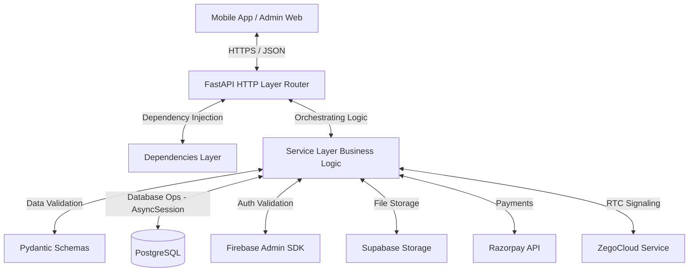

# 🛠️ Serviko Backend

[](https://fastapi.tiangolo.com/)
[](https://www.postgresql.org/)
[](https://firebase.google.com/)
[](https://supabase.com/)
[](https://www.sqlalchemy.org/)

Serviko Backend is a production-grade, asynchronous RESTful API powered by **FastAPI** and **PostgreSQL**. It serves as the core orchestration and business logic layer for the Serviko service marketplace ecosystem, handling user operations, bookings, service management, payments, real-time communication and media assets.

---

## 🏗️ Architecture & Project Structure

The Serviko backend adheres to a highly disciplined, **feature-based (domain-driven) modular architecture**, ensuring clean separation of concerns and effortless scaling.

### System Architecture Flow



### Folder Layout

```directory
serviko_backend/
├── alembic/                    # Alembic Database Migration Scripts
├── app/                        # Main Application Code
│   ├── core/                   # Shared Infrastructure & Configuration
│   │   ├── base_model.py       # Declarative base class for models
│   │   ├── config.py           # Pydantic Settings implementation
│   │   ├── database.py         # Async Database engine & Session generator
│   │   ├── exception_handlers.py # Global FastAPI exception handlers
│   │   ├── exceptions.py       # Custom Serviko exceptions
│   │   ├── firebase.py         # Firebase Authentication handler
│   │   ├── responses.py        # Generic response envelope wrappers
│   │   └── storage.py          # Supabase Storage client integration
│   ├── features/               # Feature-Based Modules (Domain Layers)
│   │   ├── auth/               # OTP, Registration verification & Role management
│   │   ├── bookings/           # Booking orchestration & state machine
│   │   ├── categories/         # Service categorizations
│   │   ├── category_requests/  # Provider-submitted categories
│   │   ├── communication/      # ZegoCloud chat/call tokens
│   │   ├── payments/           # Razorpay checkout & webhook processing
│   │   ├── providers/          # Service provider verification & profiles
│   │   ├── services/           # Available marketplace services
│   │   ├── support/            # Customer support tickets & issues
│   │   └── users/              # User profiles & settings
│   ├── utils/                  # Shared Utility Functions
│   └── main.py                 # FastAPI Application Entrypoint
├── .env.example                # Sample Environment File
├── requirements.txt            # Python Dependencies List
└── alembic.ini                 # Alembic Configuration
```


## 🛠️ Tech Stack & Core Integrations

1. **Framework**: `FastAPI` (Fully asynchronous handling with ASGI integration via Uvicorn).
2. **Database Engine**: `PostgreSQL` powered by `asyncpg` and `SQLAlchemy 2.0` declarative styling.
3. **Database Migration**: `Alembic` for schema version control.
4. **Authentication**: `Firebase Admin SDK` (Validates Firebase ID tokens, authenticating users securely on every protected route).
5. **Storage Provider**: `Supabase Storage` (Handles avatars, service banners, and provider documents with custom UUID renaming and server-side magic byte validation).
6. **Payment Gateway**: `Razorpay Gateway` (For secure payments, webhook validation, and transaction reconciliation).
7. **RTC Call Integration**: `ZegoCloud` (Generates JWT tokens on demand for video/voice call signaling).

---

## 🚀 Local Development Setup

Follow these steps to set up and run the Serviko backend locally:

### 1. Prerequisites
- Python **3.10** or higher
- PostgreSQL Database
- Firebase Admin Project (with private key credentials downloaded)
- Supabase Project (with buckets configured for `profile-images`, `provider-documents`, and `provider-banners`)

### 2. Environment Configuration
Duplicate the `.env.example` file and rename it to `.env`:
```bash
cp .env.example .env
```
Fill in the credentials mapping to your local/cloud configurations (refer to the documentation inside `.env.example`).


### 3. Virtual Environment & Dependencies
Create a virtual environment, activate it and install all dependencies:

**Windows (PowerShell):**
```powershell
python -m venv venv
.\venv\Scripts\Activate.ps1
python -m pip install --upgrade pip
pip install -r requirements.txt
```

**macOS / Linux:**
```bash
python3 -m venv venv
source venv/bin/activate
python3 -m pip install --upgrade pip
pip install -r requirements.txt
```

### 4. Database Migrations
Initialize your database and apply all schema migrations up to the head revision:
```bash
alembic upgrade head
```

### 5. Running the Application
Start the Uvicorn ASGI server with hot reloading enabled:
```bash
uvicorn app.main:app --reload 
```